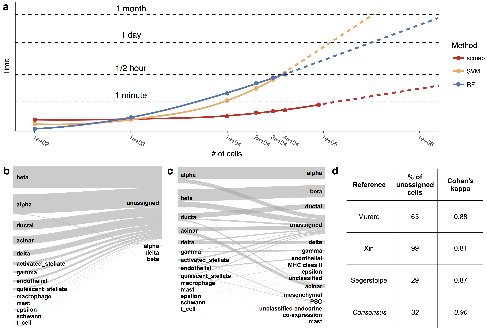

## scmap paper figures
This repository contains scripts for recreation of the figures from the scmap paper.

### Required R libraries

[cowplot](https://cran.r-project.org/web/packages/cowplot/index.html)  
[scmap](https://github.com/hemberg-lab/scmap)  
[irr](https://cran.r-project.org/web/packages/irr/index.html)  

### Fig. 1
[data_a](data/fig1a.csv)  
[data_b](data/fig1b.csv)  
[data_cd](data/fig1cd.csv)  
[data_e](data/fig1e.csv)  
[script](fig1.R)  
[pdf](fig1.pdf)

### Fig. 2
[data_a](data/fig2a.txt)  
[data_bcd1](data/fig2b-labs.csv)  
[data_bcd2](data/fig2b-sims.csv)  
[data_bcd3](data/fig2b-orig-labs.csv)  
[script](fig2.R)  
[pdf](fig2-all.pdf)

Additional figures (__b__,__c__ and __d__) are added using Keynote.app. The Keynote file is available [here](fig2-all.key).

