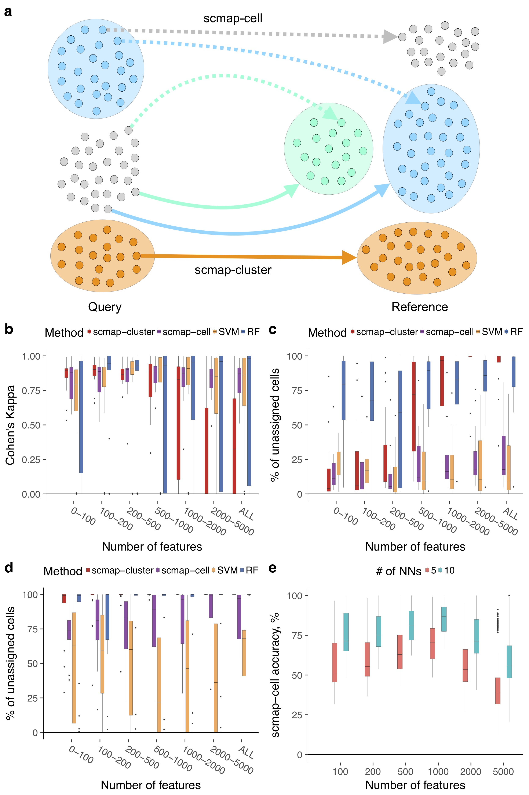
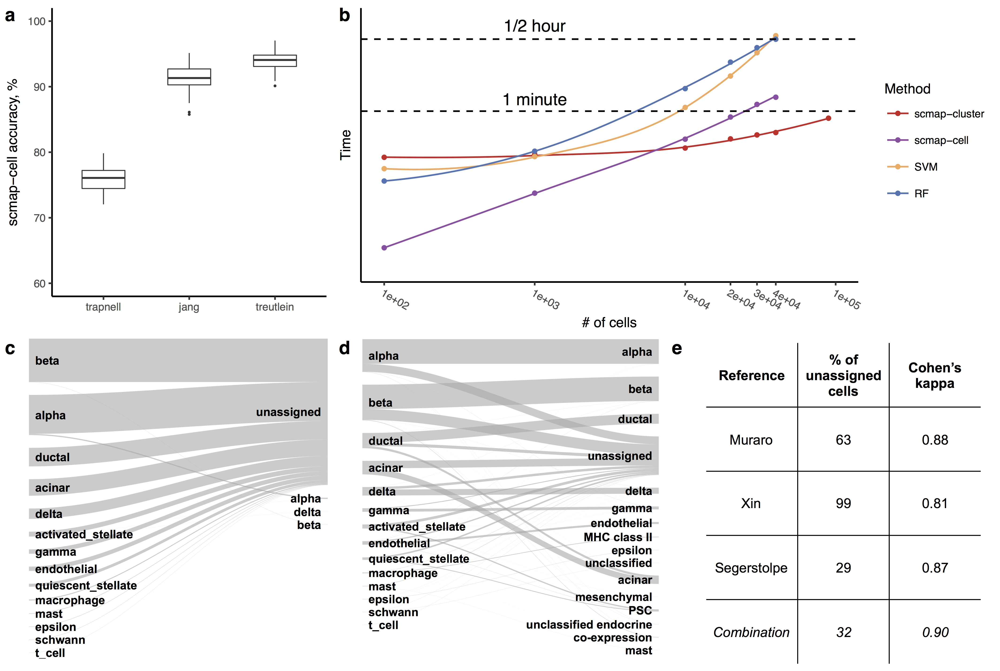
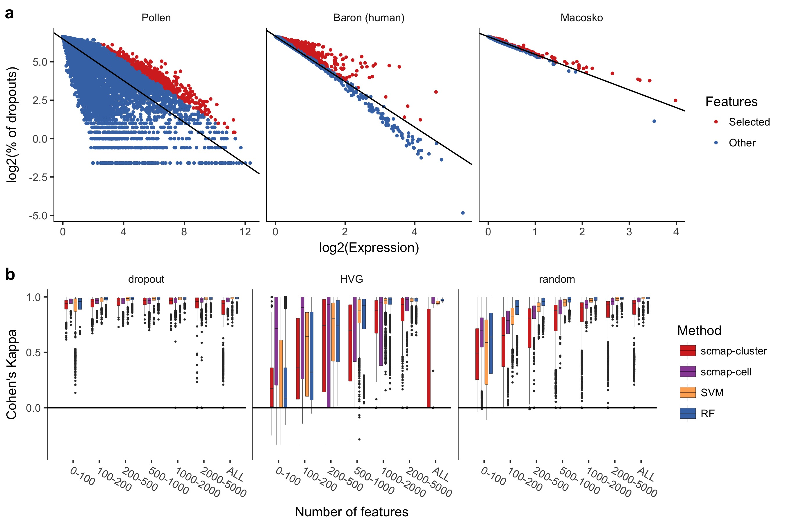
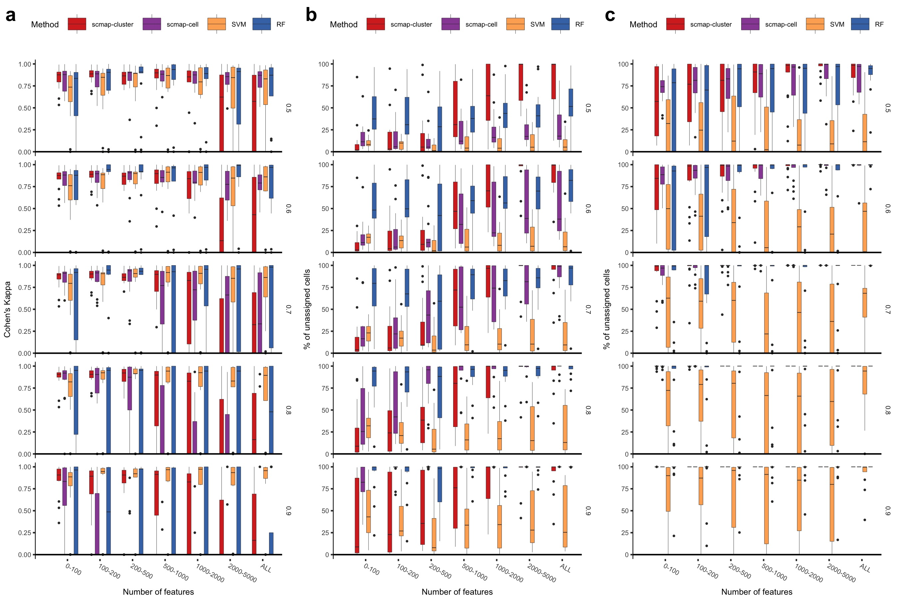
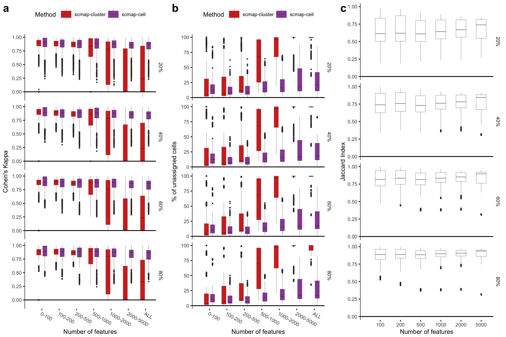
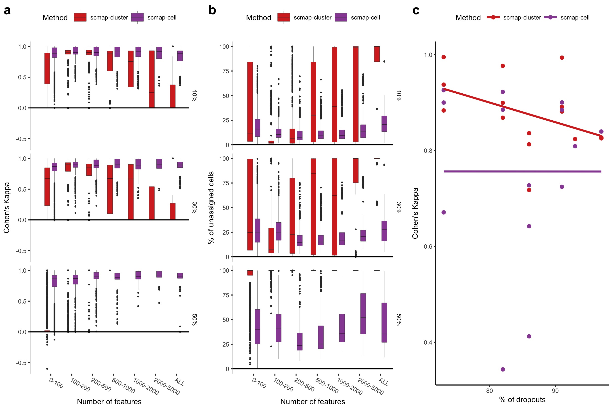

% scmap paper figures

This repository contains scripts to recreate the figures from the [scmap paper](https://www.biorxiv.org/content/early/2017/11/29/150292).

### Required R libraries

[cowplot](https://cran.r-project.org/web/packages/cowplot/index.html)  
[scmap](http://bioconductor.org/packages/scmap/)  
[irr](https://cran.r-project.org/web/packages/irr/index.html)  
[googleVis](https://cran.r-project.org/web/packages/googleVis/index.html)

### Fig. 1
[data_bc](data/fig1bc.csv)  
[data_d](data/fig1d.csv)  
[data_e](data/fig1e.csv)  
[script](1bcde.R)  
[keynote](keynote/1.key)  
[pdf](keynote/1.pdf)  
[jpg](keynote/1.jpg)  

### Fig. 2
[data_a](data/fig2a.txt)  
[data_b](data/fig2b.csv)  
[data_cd](data/fig2cd.csv)  
[script](2abcd.R)  
[keynote](keynote/2.key)  
[pdf](keynote/2.pdf)  
[jpg](keynote/2.jpg)  

### Fig. S1

[data_a](data/figS1a.csv)  
[data_b](data/figS1b.csv)  
[script](S1.R)  
[pdf](pdf/S1.pdf)  
[jpeg](jpeg/S1.jpeg)  

### Fig. S2

[data_a](data/fig1bc.csv)  
[data_b](data/fig1bc.csv)  
[data_c](data/fig1d.csv)  
[script](S2.R)  
[pdf](pdf/S2.pdf)  
[jpeg](jpeg/S2.jpeg)  

### Fig. S3

[data_a](data/figS3ab.csv)  
[data_b](data/figS3ab.csv)  
[data_c](data/figS3c.csv)  
[script](S3.R)  
[pdf](pdf/S3.pdf)  
[jpeg](jpeg/S3.jpeg)  

### Fig. S4

[data_a](data/figS4.csv)  
[data_b](data/figS4.csv)  
[data_c](data/fig1bc.csv)  
[script](S4.R)  
[pdf](pdf/S4.pdf)  
[jpeg](jpeg/S4.jpeg)  

### Table S1

[data_compression](data/tableS1.csv)
